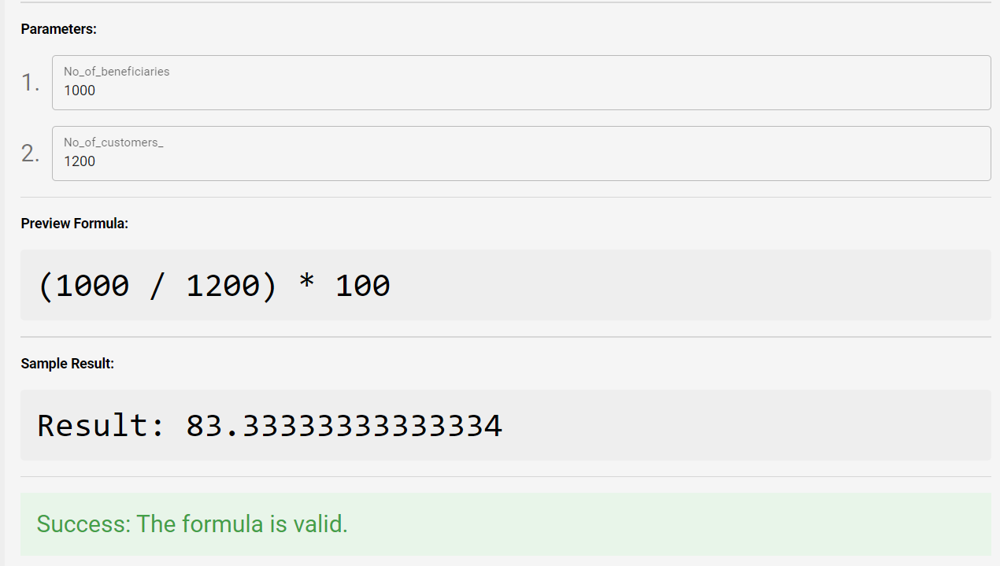

# ✳️ Managing Project Challenges


**Additional Tips**

* **Mandatory Fields**: Ensure all mandatory fields (marked with \*) are completed before submitting the form.
* **Language Consistency**: Enter risk details in both English and Arabic to maintain language consistency.
* **Regular Updates**: Periodically review and update the status of risks to reflect the current situation accurately.


<figure><figcaption></figcaption></figure>

## Adding a Project Challenge

1. Navigate to the management menu in the application interface.\
   
2. Click on the **(+) icon button** located at the top right of the "Project Challenge" section.\
   .png>)
3. **Fill Out the Challenge Form**
   * Complete the required fields in the Challenge form:
     * **Description (English)**: Provide a detailed description of the risk in English.
     * **Description (Arabic)**: Provide a detailed description of the risk in Arabic.
     * **Owner**: Select the owner responsible for managing this challenge.\
       .png>)
     * **Deadline**: Set the deadline for addressing this challenge.
     * **Level**: Choose the risk level (e.g., High, Medium, Low).
     * **Status**: Select the current status of the challenge.\
       \
       .png>)
4. **Submit the Challenge**
   * After completing the form, click on the "Submit" button to save the Project Challenege.
   * The challenge will now be added to the project challenge list.

<figure><figcaption></figcaption></figure>

## Viewing and Editing a Project Challenges

1. **Locate the Added Risk**
   * Find the risk you added in the Project Challenges section. It will appear in the list under the Project Challenges section.&#x20;
   * **Edit the Challenges**
     * To edit the challenge, click the pencil icon (edit button) next to the challenge.
     * The Challenge form will open, allowing you to make necessary changes.
     * After editing, click "Submit" to save the updates.
2. **Deleting a Project** Challenge&#x20;
   1. **Locate the** Challenge&#x20;
      * In the Project Challenge section, find the risk you wish to delete.
   2. **Delete the** Challenge&#x20;
      * Click on the trash can icon (delete button) next to the challenge.
      * Confirm the deletion if prompted. The challenge will be removed from the list.

## Adding a Mitigation to a Project Challenge

<figure><figcaption></figcaption></figure>

1.  **Navigate to the Project Challenges Section**

    * Locate the relevant initiative where the project challenge exists.

    **1.1 Locate the Project Challenge**

    * Find the specific project challenge you want to add a mitigation

    1.2 **Click on the "+" Icon**

    * As shown in the screenshot, click on the green "+" icon to add a new mitigation under the selected project challenge. This will open the Mitigation pop-up form.
2. **Fill Out the Mitigation Form**
   * Complete the required fields in the Mitigation form:
     * **Description**: Enter a detailed description of the mitigation measure.
     * **Division**: Select the division responsible for implementing this mitigation.
     * **Deadline**: Set the deadline for completing this mitigation.
   * The form fields are similar to those used for adding a project challenge.
3. After completing the form, click on the "Submit" button to save the mitigation.
   * The mitigation will now be added under the specific project challenge.

## **Viewing and Editing a Mitigation**

1. **Locate the Mitigation**
   * Find the mitigation you added under the relevant project challenge in the Project Challenges section.
2. **Edit the Mitigation**
   * To edit the mitigation, click on the pencil icon (edit button) next to the mitigation entry.
   * The Mitigation form will open, allowing you to make necessary changes.
   * After editing, click "Submit" to save the updates.

**Deleting a Mitigation**

1. **Locate the Mitigation**
   * In the Project Challenges section, find the mitigation you wish to delete.
2. **Delete the Mitigation**
   * Click on the trash can icon (delete button) next to the mitigation entry.
   * Confirm the deletion if prompted. The mitigation will be removed from the list.


By following these steps, you can efficiently manage project challenges and their mitigations within the system, ensuring all relevant information is captured and updated as needed.

