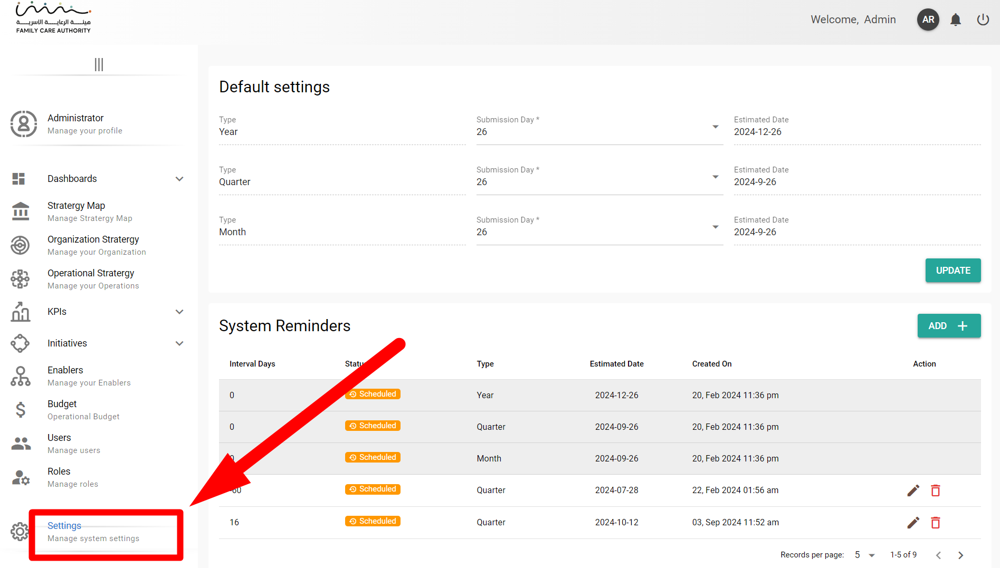

# 🟢 Guide for Section Head Users


### **Best Practices**

* **Regularly Check Notifications**: To stay up-to-date with your KPIs and Initiatives, make sure to regularly check the notifications panel and address any pending requests.
* **Monitor Progress**: Use the progress bars to keep track of your KPIs and Initiatives. Address any delays or issues early to ensure targets are met on time.
* **User Accountability**: Ensure that you are logged in with the correct username and sector to avoid any mismanagement of KPIs or Initiatives.


## Dashboard Overview

<figure><figcaption></figcaption></figure>

* **User Interface**:
  * **Username Display**: Your username is shown at the top right corner.
  * **Dashboard Menu**: Located just below the dashboard title, this menu allows you to switch between the KPIs and Initiatives lists.
* **KPIs and Initiatives**:
  * **KPI/Initiative List**: Each entry displays basic details including the title, associated sector, target completion date, target percentage, and achieved progress.
  * **Progress Bar**: Indicates the completion status of each KPI or Initiative with a visual progress bar.

## Notifications and Actions

<figure><figcaption></figcaption></figure>

> <mark style="background-color:red;">You can manage and respond to notifications directly from the dashboard.</mark>

1. **Accessing Notifications**:
   * Click on the **bell icon** at the top right corner to view notifications.
2. **Notification Details**:
   * The notification panel lists recent activities and requests related to KPIs and Initiatives.
   * Each notification includes the type of request, KPI/Initiative identifier, and timestamp.
3. **Responding to Requests**:
   * Click on a notification to be redirected to the detailed view of the specific KPI or Initiative.
   * Review the request details thoroughly.
   * Approve or reject the request based on the data provided.

<figure><figcaption></figcaption></figure>

## **Preview Indicators**

1.  **Click on the "Update" Button** next to the relevant KPI or Initiative (refer to **Screenshot**).

    * This action will open a detailed view of the indicators associated with the selected KPI or Initiative.

    <figure><figcaption></figcaption></figure>

## **Review the Results**

* **Review Indicators:**
  * Based on the percentage and result achieved as shown in the indicators, analyze the performance (refer to **Screenshot 2**).
* **Evaluate the Data:**
  * Check all the details filled in by the representative user, including the analysis and any attached documents.

<figure><figcaption></figcaption></figure>

## **Review and Analyze Results**

* An **Update Result** screen will appear. This screen allows you to review the details submitted by the previous user.
  * **Parameters:** Check the values entered under "Parameters."
  * **Result Value (Achieved):** Review the achieved result percentage.
  * **Attachments:** If any attachments are provided, review them for supporting documentation.
  * **Analysis:** Read through the analysis provided in both English and Arabic (if applicable).

## **Approve or Reject the KPI/Initiative**

* Based on your review, you have two options:
  * **Approve:** Click the "Approve" button if the KPI or Initiative meets the required standards. This action will forward the KPI/Initiative to the Division Head for further review.
  * **Reject:** Click the "Reject" button if the KPI or Initiative does not meet the standards. This action will send it back to the previous user (Representative) for corrections.

## Tips


#### :thumbsup:

1. **Ensure Correct User Login:**
   * Always verify that you are logged in with the appropriate credentials to access the correct KPIs or Initiatives.
2. **Thoroughly Review Data:**
   * Before making any decisions, carefully review all data fields, analysis notes, and attachments to ensure accuracy.
3. **Use Descriptive Analysis:**
   * When providing analysis, use clear and descriptive language that can be easily understood by the next reviewer.
4. **Double-Check Calculations:**
   * Verify that the calculation methods used in deriving the result percentages are correct and consistent with the set formulas.
5. **Prompt Feedback on Errors:**
   * If rejecting a KPI or Initiative, provide clear feedback on what needs correction to avoid repeated errors.

